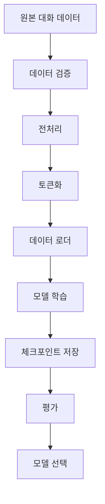
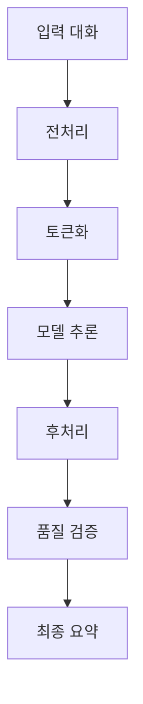

# 🏗️ 시스템 아키텍처

NLP 대화 요약 시스템의 전체 아키텍처 설계 및 구성 요소 설명입니다.

## 📋 목차

- [전체 아키텍처](#전체-아키텍처)
- [핵심 컴포넌트](#핵심-컴포넌트)
- [데이터 플로우](#데이터-플로우)
- [확장성 고려사항](#확장성-고려사항)

## 🏛️ 전체 아키텍처

### 시스템 개요
```
┌─────────────────────────────────────────────────────────────┐
│                    NLP 대화 요약 시스템                      │
├─────────────────────────────────────────────────────────────┤
│  ┌─────────────┐  ┌─────────────┐  ┌─────────────┐         │
│  │   데이터    │  │   모델     │  │   평가     │         │
│  │  처리 계층  │  │  추론 계층  │  │  검증 계층  │         │
│  └─────────────┘  └─────────────┘  └─────────────┘         │
├─────────────────────────────────────────────────────────────┤
│  ┌─────────────┐  ┌─────────────┐  ┌─────────────┐         │
│  │   실험     │  │   배포     │  │   모니터링   │         │
│  │  관리 계층  │  │  관리 계층  │  │   계층     │         │
│  └─────────────┘  └─────────────┘  └─────────────┘         │
└─────────────────────────────────────────────────────────────┘
```

### 기술 스택
- **AI Framework**: Transformers, PyTorch
- **데이터 처리**: Pandas, NumPy, Datasets
- **실험 관리**: Weights & Biases, Hydra
- **배포**: FastAPI, Docker, Kubernetes
- **모니터링**: Prometheus, Grafana

## 🔧 핵심 컴포넌트

### 1. 데이터 처리 계층
```python
class DataProcessingPipeline:
    """데이터 전처리 및 변환 파이프라인"""
    
    def __init__(self, config):
        self.tokenizer = AutoTokenizer.from_pretrained(config.model_name)
        self.preprocessor = TextPreprocessor()
        self.validator = DataValidator()
    
    def process(self, raw_data):
        # 1. 데이터 검증
        validated_data = self.validator.validate(raw_data)
        
        # 2. 전처리
        preprocessed_data = self.preprocessor.process(validated_data)
        
        # 3. 토큰화
        tokenized_data = self.tokenizer(
            preprocessed_data,
            max_length=1024,
            truncation=True,
            padding=True
        )
        
        return tokenized_data
```

### 2. 모델 추론 계층
```python
class ModelInferenceEngine:
    """모델 추론 엔진"""
    
    def __init__(self, model_path, device='cuda'):
        self.model = AutoModelForSeq2SeqLM.from_pretrained(model_path)
        self.model.to(device)
        self.device = device
        
    def generate_summary(self, input_texts, **kwargs):
        # 배치 처리
        inputs = self.tokenizer(
            input_texts,
            return_tensors='pt',
            padding=True,
            truncation=True
        ).to(self.device)
        
        with torch.no_grad():
            outputs = self.model.generate(
                **inputs,
                max_length=256,
                num_beams=4,
                no_repeat_ngram_size=2,
                **kwargs
            )
        
        summaries = self.tokenizer.batch_decode(
            outputs, skip_special_tokens=True
        )
        
        return summaries
```

### 3. 평가 검증 계층
```python
class EvaluationFramework:
    """종합 평가 프레임워크"""
    
    def __init__(self):
        self.rouge_evaluator = ROUGEEvaluator()
        self.quality_checker = QualityChecker()
        self.bias_detector = BiasDetector()
    
    def comprehensive_evaluation(self, predictions, references):
        results = {}
        
        # ROUGE 점수 계산
        results['rouge'] = self.rouge_evaluator.compute(
            predictions, references
        )
        
        # 품질 평가
        results['quality'] = self.quality_checker.assess(
            predictions
        )
        
        # 편향성 검사
        results['bias'] = self.bias_detector.analyze(
            predictions
        )
        
        return results
```

## 📊 데이터 플로우

### 학습 데이터 플로우


### 추론 데이터 플로우


### 실시간 처리 아키텍처
```python
class RealTimeProcessor:
    """실시간 요약 처리 시스템"""
    
    def __init__(self):
        self.queue = Queue(maxsize=1000)
        self.workers = []
        self.result_cache = TTLCache(maxsize=10000, ttl=3600)
    
    async def process_request(self, request_id, input_text):
        # 캐시 확인
        cache_key = hashlib.md5(input_text.encode()).hexdigest()
        if cache_key in self.result_cache:
            return self.result_cache[cache_key]
        
        # 처리 큐에 추가
        await self.queue.put({
            'id': request_id,
            'text': input_text,
            'timestamp': time.time()
        })
        
        # 결과 대기
        result = await self.wait_for_result(request_id)
        
        # 캐시 저장
        self.result_cache[cache_key] = result
        
        return result
```

## 🚀 확장성 고려사항

### 수평 확장
- **마이크로서비스 아키텍처**: 각 컴포넌트 독립 배포
- **로드 밸런싱**: 트래픽 분산 처리
- **데이터베이스 샤딩**: 데이터 분산 저장

### 성능 최적화
```python
class ScalabilityManager:
    """확장성 관리자"""
    
    def __init__(self):
        self.auto_scaler = AutoScaler()
        self.load_balancer = LoadBalancer()
        self.cache_manager = CacheManager()
    
    def handle_load_spike(self, current_load):
        if current_load > 0.8:
            # 인스턴스 추가
            self.auto_scaler.scale_up()
            
            # 캐시 워밍
            self.cache_manager.warm_cache()
            
            # 로드 밸런서 업데이트
            self.load_balancer.update_targets()
```

### 장애 복구
- **Circuit Breaker**: 연쇄 장애 방지
- **Graceful Degradation**: 점진적 성능 저하
- **Health Check**: 시스템 상태 모니터링

```python
class HealthChecker:
    """시스템 건강 상태 검사"""
    
    def __init__(self):
        self.checks = [
            self.check_model_health,
            self.check_database_connection,
            self.check_cache_status,
            self.check_memory_usage
        ]
    
    async def perform_health_check(self):
        results = {}
        
        for check in self.checks:
            try:
                results[check.__name__] = await check()
            except Exception as e:
                results[check.__name__] = f"FAILED: {str(e)}"
        
        return results
```

## 🔗 관련 문서

- **연계**: [성능 최적화](./performance_optimization.md)
- **연계**: [에러 처리](./error_handling.md)
- **연계**: [보안 가이드라인](./security_guidelines.md)
- **심화**: [프로젝트 구조](./architecture/project_structure.md)

---
📍 **위치**: `docs/03_technical_docs/system_architecture.md`
