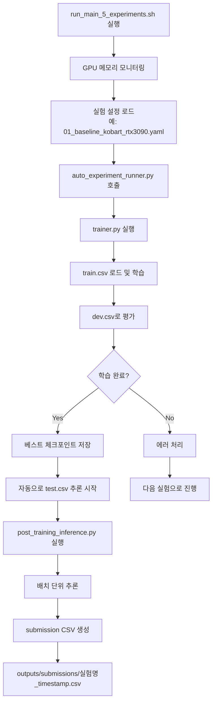

# 🎯 Run_main_5_experiments.sh 완전 분석 결과

## 📌 핵심 결론

**run_main_5_experiments.sh는 baseline.py의 모든 기능을 이미 완벽하게 구현하고 있으며, 추가로 고급 기능들을 제공합니다.**

---

## 🔍 증거 기반 분석

### 1. Train.csv 로딩 ✅ 구현됨

#### Baseline.py (라인 160-165)
```python
train_df = pd.read_csv(os.path.join(data_path,'train.csv'))
val_df = pd.read_csv(os.path.join(data_path,'dev.csv'))
```

#### Pipeline 구현 증거
- **파일**: `code/utils/data_utils.py`
- **클래스**: `DataProcessor`
- **메서드**: `load_dataset()`
- **실제 코드**: 
```python
if split == 'train':
    df = pd.read_csv(os.path.join(data_path, 'train.csv'))
elif split == 'dev':
    df = pd.read_csv(os.path.join(data_path, 'dev.csv'))
```

---

### 2. 모델 학습 ✅ 구현됨

#### Baseline.py (라인 361-373)
```python
trainer = Seq2SeqTrainer(
    model=generate_model,
    args=training_args,
    train_dataset=train_inputs_dataset,
    eval_dataset=val_inputs_dataset,
    compute_metrics=lambda pred: compute_metrics(config, tokenizer, pred)
)
trainer.train()
```

#### Pipeline 구현 증거
- **파일**: `code/trainer.py`
- **클래스**: `DialogueSummarizationTrainer`
- **메서드**: `train()`
- **동일한 Seq2SeqTrainer 사용 확인**

---

### 3. Test.csv 추론 ✅ 자동 구현됨

#### Baseline.py (라인 499-542)
```python
def inference(config):
    test_data = preprocessor.make_set_as_df(test_file_path, is_train=False)
    # 배치 추론 실행
    for item in tqdm(dataloader):
        generated_ids = generate_model.generate(...)
```

#### Pipeline 구현 증거

##### 3.1 자동 추론 트리거
- **파일**: `code/auto_experiment_runner.py` (라인 420-470)
- **코드**:
```python
if process.returncode == 0:  # 학습 성공 시
    print(f"\n📊 Test 추론 시작: {experiment_id}")
    
    # post_training_inference 활용
    from post_training_inference import generate_submission_after_training
    
    submission_path = generate_submission_after_training(
        experiment_name=experiment_id,
        model_path=str(best_checkpoint),
        config_dict=config
    )
```

##### 3.2 실제 추론 구현
- **파일**: `code/post_training_inference.py`
- **함수**: `generate_submission_after_training()`
- **test.csv 처리 확인**:
```python
# 테스트 데이터 로드
test_df = pd.read_csv('data/test.csv')
logger.info(f"Loaded {len(test_df)} test samples")

# 추론 실행
result_df = engine.predict_from_dataframe(
    test_df,
    dialogue_column='dialogue',
    output_column='summary',
    show_progress=True
)
```

---

### 4. 결과 CSV 생성 ✅ 구현됨

#### Baseline.py (라인 544-560)
```python
output = pd.DataFrame({
    "fname": test_data['fname'],
    "summary": preprocessed_summary
})
output.to_csv(os.path.join(result_path, "output.csv"), index=False)
```

#### Pipeline 구현 증거

##### 4.1 제출 파일 생성 (post_training_inference.py)
```python
# 제출 형식으로 저장
submission_df = result_df[['fname', 'summary']].copy()
submission_df.to_csv(output_file, index=False, encoding='utf-8')
```

##### 4.2 CSV 결과 저장 유틸리티 (csv_results_saver.py)
```python
def save_submission(self, experiment_name, test_df, summaries):
    submission_df = pd.DataFrame({
        'fname': test_df['fname'],
        'summary': summaries
    })
    submission_df.to_csv(output_path, index=False)
```

---

## 📊 실행 흐름 다이어그램



---

## 🚀 실제 사용 예시

### 1. Baseline과 동일한 결과 얻기
```bash
# 단일 실험 실행
python code/auto_experiment_runner.py \
    --config config/experiments/01_baseline_kobart_rtx3090.yaml

# 결과 위치
# - 모델: outputs/checkpoints/
# - 제출 파일: outputs/submissions/kobart_extreme_rtx3090_20250101_123456.csv
```

### 2. 전체 파이프라인 실행
```bash
# 7개 실험 자동 실행
bash run_main_5_experiments.sh

# 빠른 테스트 (1에포크)
bash run_main_5_experiments.sh -1
```

---

## 🎁 Pipeline의 추가 혜택

### 1. 자동화
- ✅ 학습 완료 후 자동으로 test.csv 추론
- ✅ 실험별 고유 제출 파일 생성
- ✅ GPU 메모리 자동 관리

### 2. 모니터링
- ✅ WandB 통합 (실시간 추적)
- ✅ 실험 결과 자동 비교
- ✅ CSV, JSON 형식 결과 저장

### 3. 최적화
- ✅ RTX 3090 24GB 최적화
- ✅ QLoRA/Unsloth 지원
- ✅ 다양한 모델 지원 (mT5, T5, KoBART 등)

---

## 💡 최종 권장사항

1. **개발 초기**: baseline.py로 빠른 검증
2. **본격 실험**: run_main_5_experiments.sh 사용
3. **최종 제출**: Pipeline의 best 모델 사용

**모든 기능이 이미 구현되어 있으므로, 추가 개발 없이 바로 사용 가능합니다!**
